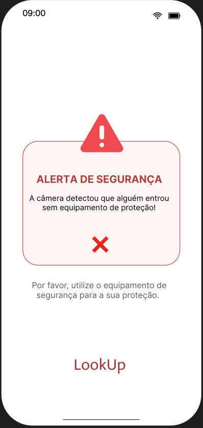
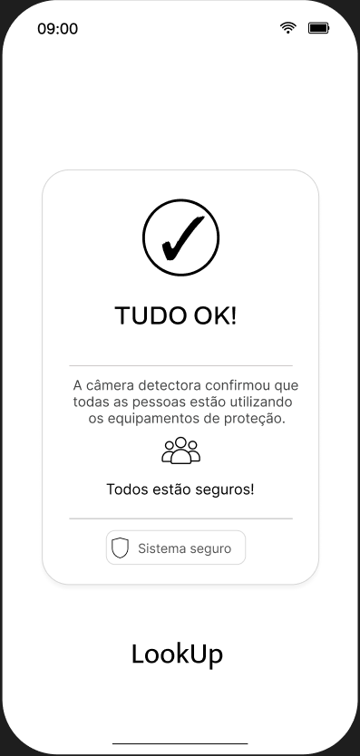

# 🦺 Sistema Inteligente de Detecção de EPIs

## 📌 Sobre o Projeto

Este projeto tem como objetivo desenvolver uma solução de visão computacional capaz de identificar Equipamentos de Proteção Individual (EPIs) utilizados por pessoas em ambientes de trabalho.

A solução utiliza uma webcam para capturar imagens em tempo real e um modelo de Inteligência Artificial para realizar a detecção dos objetos presentes na imagem.

Até o momento (25/08/2026) o projeto está passando por testes com diferentes modelos de detecção, buscando encontrar uma solução capaz de identificar os principais EPIs necessários para o sistema.

---

# 🎯 Objetivo

O objetivo principal do projeto é desenvolver um sistema capaz de utilizar uma câmera para identificar uma pessoa e verificar a presença de Equipamentos de Proteção Individual.

Entre os EPIs considerados inicialmente estão:

- 🪖 Capacete de segurança;
- 🦺 Roupa de segurança;
- 🥽 Óculos de proteção;
- 🧤 Luvas;
- 😷 Máscara.

A solução deverá futuramente permitir identificar quando um ou mais equipamentos obrigatórios não estiverem presentes.

---

# 🧩 MODELAGEM

A equipe realizou uma modelagem inicial da solução antes do desenvolvimento, buscando definir como o sistema funcionará e quais componentes serão necessários.

A modelagem é composta por:

- Wireframes;
- Protótipos iniciais;
- Arquitetura inicial da solução.

---

## 🖼️ Wireframes

Os wireframes representam a organização visual da nossa solução em um aplicativo de celular e futuramente adaptado para mobile também. Serão utilizados para definir a interface que apresentará os resultados das detecções realizadas pela câmera, para que o gestor possaa ser notificado quando o detector captar que algum funcionário não está equipado corretamente.


Essa imagem representa um alerta de que alguém não está utilizando EPI e o gestor foi notificado de tal ocorrido pelo próprio celular.


Essa imagem mostra a mesma tela porém sem nenhuma notificação até o momento.
---

# 🧪 Protótipos Iniciais

Antes da definição do modelo utilizado na solução, foram realizados testes com diferentes modelos de Inteligência Artificial.

O objetivo dos protótipos foi verificar quais modelos apresentavam melhor capacidade de identificar os Equipamentos de Proteção Individual necessários para o projeto.

Foram desenvolvidos três protótipos iniciais.

---

## 🔹 Protótipo 1

O primeiro protótipo utilizou um modelo inicial de detecção de objetos aplicado à webcam.

Durante os testes, o modelo apresentou capacidade de identificar principalmente o capacete de segurança.

Entretanto, apresentou dificuldades para identificar outros equipamentos, como:

- Óculos de proteção;
- Luvas;
- Roupa de segurança.

Apesar das limitações, o primeiro protótipo foi importante para validar o funcionamento inicial da webcam integrada ao modelo de Inteligência Artificial.

### Resultado

O modelo conseguiu demonstrar que era possível utilizar a webcam para realizar detecções em tempo real, porém apresentou limitações na quantidade de EPIs identificados.

---

## 🔹 Protótipo 2

Após os testes realizados no primeiro protótipo, foi utilizado um segundo modelo de detecção de EPIs.

Esse modelo apresentou uma melhoria em relação ao primeiro protótipo, conseguindo identificar:

- 🪖 Capacete;
- 🦺 Roupa de segurança.

Entretanto, durante os testes realizados, os óculos e as luvas ainda não foram identificados de forma adequada.

### Resultado

O segundo protótipo apresentou uma evolução em relação ao primeiro, principalmente pela identificação da roupa de segurança.

Porém, ainda não atendia completamente às necessidades do projeto.

---

## 🔹 Protótipo 3

O terceiro protótipo utilizou um modelo YOLOv5 voltado para detecção de Equipamentos de Proteção Individual.

O modelo foi integrado à webcam e testado em diferentes imagens e situações.

Durante os testes realizados, foi possível identificar:

- 👤 Pessoa;
- 🪖 Capacete;
- 🦺 Roupa de segurança;
- 🥽 Óculos de proteção;
- 🧤 Luvas.

A identificação de óculos e luvas representou uma evolução importante em relação aos protótipos anteriores, pois esses equipamentos não estavam sendo identificados adequadamente nos testes anteriores.

A identificação da máscara ainda está em fase de testes.

Também foram observados casos de possíveis classificações incorretas, como uma situação em que uma máscara foi identificada como capacete. Por isso, novos testes ainda serão realizados para avaliar a precisão do modelo.

### Resultado

Até o momento, o Protótipo 3 apresentou os resultados mais promissores entre os modelos testados e foi definido como a principal base para a continuidade do desenvolvimento da solução.

---

## 📊 Comparação dos Protótipos

| EPI / Objeto | Protótipo 1 | Protótipo 2 | Protótipo 3 |
|---|---|---|---|
| 👤 Pessoa | — | — | ✅ |
| 🪖 Capacete | ✅ | ✅ | ✅ |
| 🦺 Roupa de segurança | ❌ | ✅ | ✅ |
| 🥽 Óculos de proteção | ❌ | ❌ | ✅ |
| 🧤 Luvas | ❌ | ❌ | ✅ |
| 😷 Máscara | ❌ | ❌ | 🔄 Em teste |

**Legenda:**

- ✅ Identificado nos testes;
- ❌ Não identificado adequadamente;
- 🔄 Ainda em testes;
- — Não avaliado no protótipo.

> Os resultados apresentados correspondem aos testes iniciais realizados pela equipe. O desempenho da detecção pode variar de acordo com iluminação, distância da câmera, qualidade da imagem, posição da pessoa e características dos EPIs.

---

# 🏗️ Arquitetura Inicial da Solução

A arquitetura inicial da solução é composta por uma webcam, um computador responsável pelo processamento das imagens, uma aplicação desenvolvida em Python e um modelo de Inteligência Artificial responsável pela detecção dos objetos.

O funcionamento inicial da solução pode ser representado pelo seguinte fluxo:

```text
                  ┌──────────────┐
                  │    WEBCAM    │
                  └──────┬───────┘
                         │
                         ▼
              ┌─────────────────────┐
              │ Captura da imagem   │
              │    em tempo real    │
              └──────────┬──────────┘
                         │
                         ▼
              ┌─────────────────────┐
              │ Aplicação em Python │
              └──────────┬──────────┘
                         │
                         ▼
              ┌─────────────────────┐
              │ Modelo de IA / YOLO │
              └──────────┬──────────┘
                         │
                         ▼
              ┌─────────────────────┐
              │ Detecção dos objetos│
              └──────────┬──────────┘
                         │
                         ▼
              ┌─────────────────────┐
              │ Identificação dos   │
              │ EPIs detectados     │
              └──────────┬──────────┘
                         │
                         ▼
              ┌─────────────────────┐
              │ Exibição do         │
              │ resultado            │
              └─────────────────────┘
